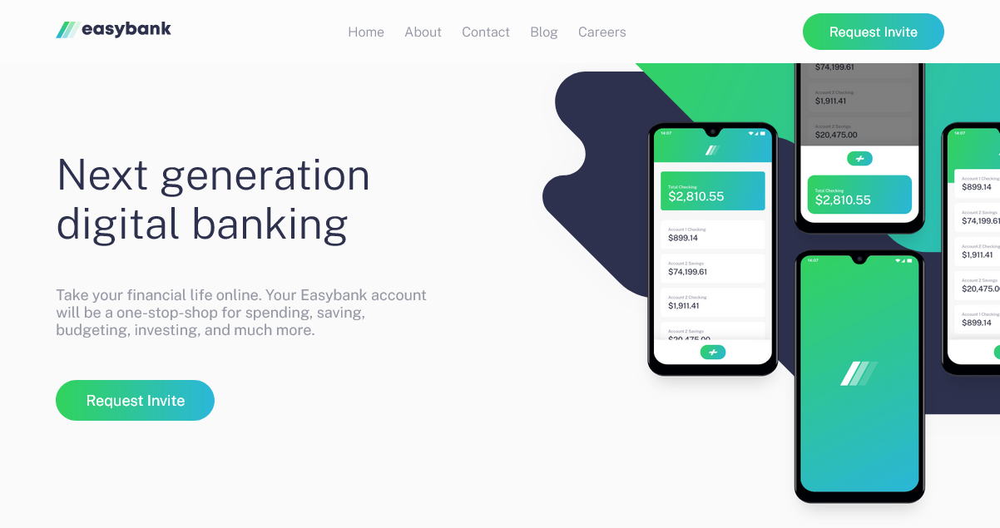
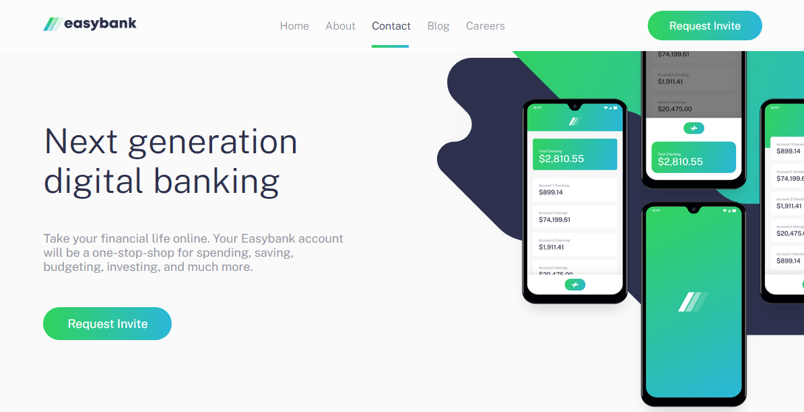
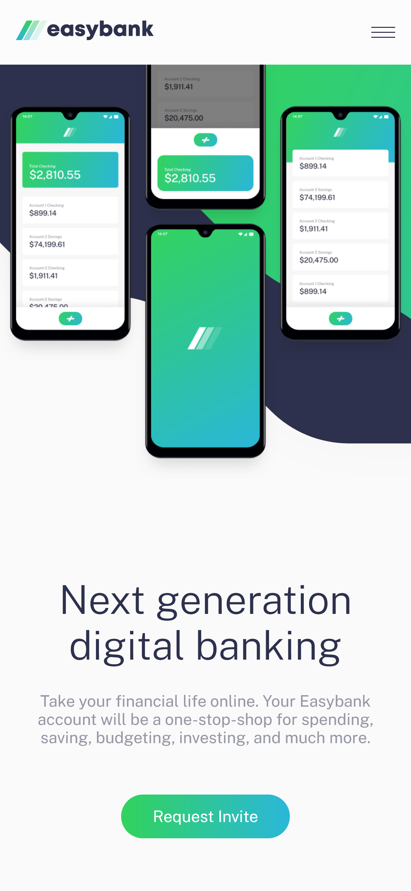
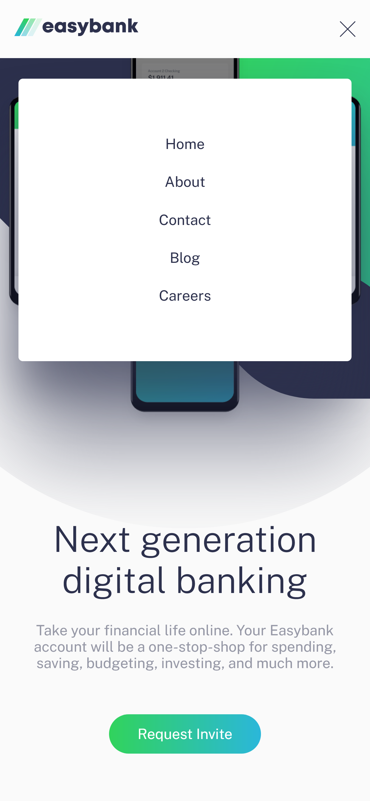

# Easybank Landing Page 🏦

This is a solution to the [Easybank landing page challenge on Frontend Mentor](https://www.frontendmentor.io/challenges/easybank-landing-page-WaUhkoDN). Frontend Mentor challenges help you improve your coding skills by building realistic projects.

## Table of contents

- [Overview](#overview)
  - [The challenge](#the-challenge)
  - [Screenshot](#screenshot)
  - [Links](#links)
  - [Built with](#built-with)
- [Author](#author)

## Overview

### The challenge

Users should be able to:

- View the optimal layout for the site depending on their device's screen size
- See hover states for all interactive elements on the page

### Screenshot

Desktop Design

  

Active States

  

Mobile Design

  

Mobile Navigation

  

### Links

- [Solution URL](https://www.frontendmentor.io/solutions/easybank-landing-page-using-scss-nZRLoGKIhl)
- [Live Site URL](https://easybank-landing-page-josemiguel02.netlify.app)

### Built with

- Semantic HTML5 markup
- SCSS
- CSS custom properties
- Flexbox
- CSS Grid
- BEM Methodology
- Mobile-first workflow
- OOP

## Author

- Website - [josemidev.me](https://josemidev.me)
- Frontend Mentor - [@josemiguel02](https://www.frontendmentor.io/profile/josemiguel02)
- Gmail - [josemidev24@gmail.com](mailto:josemidev24@gmail.com)
